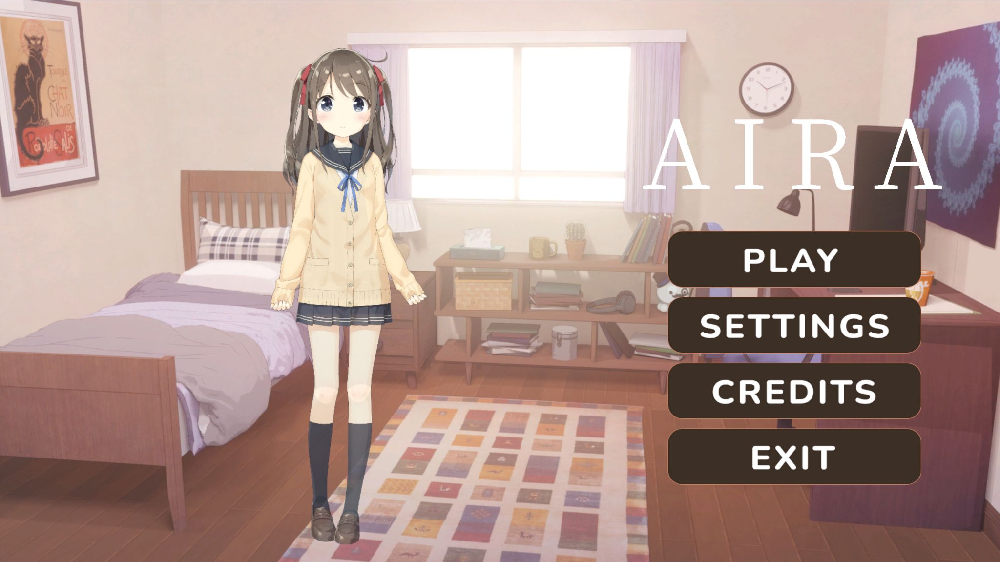
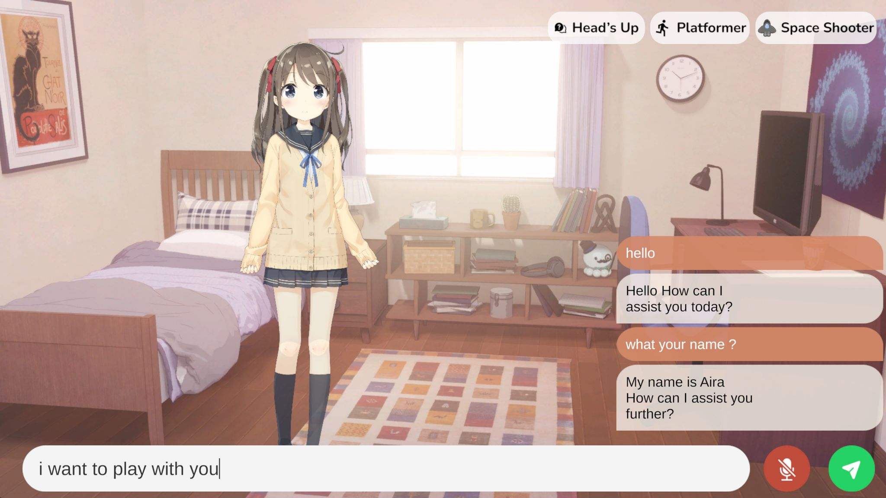
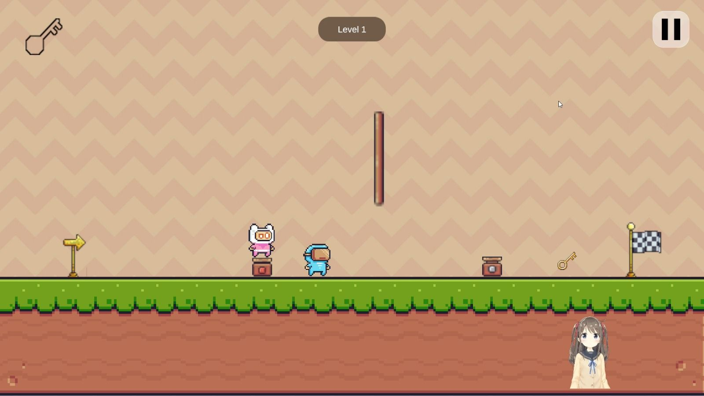
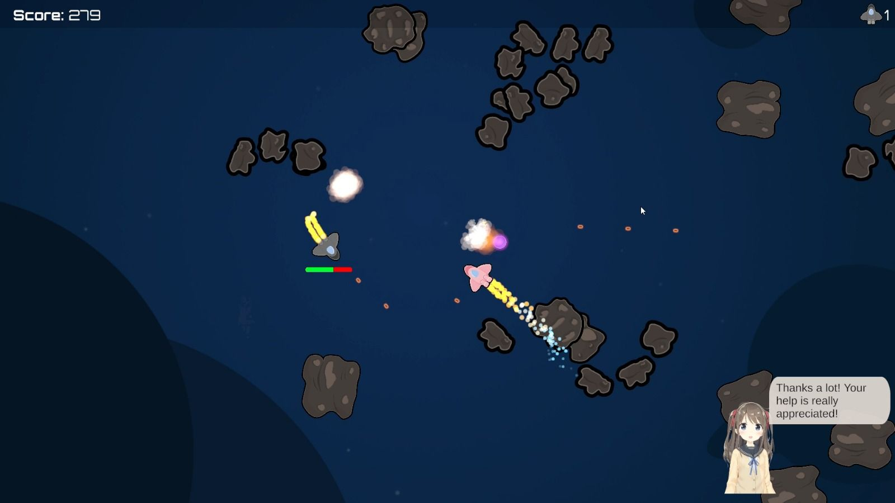

# AIRA  (Artificial Interactive Room Assistant)

An interactive Live2D companion application powered by a Local AI (SLM), designed to respond to conversations in real-time and run fully offline on your PC.



## Tech Stack

| Component          | Details                                                |
| ------------------ | ------------------------------------------------------ |
| Engine             | Unity 6.3 LTS (URP)                                    |
| Live2D             | Cubism SDK 5-r.4.1 (Character: Hiyori Momose)          |
| AI Foundation      | Qwen 2.5 3B Q4_K_M (via LLMUnity / Llama.cpp)          |
| STT                | Whisper (via whisper.unity) offline speech recognition |
| TTS                | Piper TTS offline text-to-speech                       |
| Emotion Classifier | DistilBERT ONNX (optional)                             |

## Key Features

- **Free Chat**: natural conversation with AIRA via text or voice
- **Mini-Games**: play alongside AIRA with real-time AI commentary
- **Memory System**: AIRA remembers previous conversations across sessions
- **Live2D Expressions**: reactive facial expressions ([HAPPY], [SAD], [SURPRISED], etc.)
- **TTS + Lip-sync**: AIRA speaks with synchronized lip movement
- **Offline STT**: talk directly to AIRA without any internet connection
- **Emotion Classifier**: detects user emotions for more empathetic responses (optional)



## Mini-Games

| Game               | Status   | Description                                                       |
| ------------------ | -------- | ----------------------------------------------------------------- |
| Head's Up!         | Playable | Word guessing game take turns giving clues and guessing with AIRA |
| Platformer Coop    | Playable | Cooperative puzzle platformer with AIRA                           |
| Space Shooter Coop | Playable | Top-down shooter with AIRA as co-pilot                            |




## Setup Guide

Due to GitHub's file size limit (100MB max), AI model files and some core engine libraries (LlamaLib) are not included directly in this repository. Follow the steps below to get AIRA running on your machine.

### 1. Clone the Repository

```bash
git clone https://github.com/Raditya-0/Project-AIRA
```

### 2. Download the Local AI Model

AIRA requires the **Qwen 2.5 3B (Q4_K_M)** model as its core intelligence.

- **Download:** [Hugging Face qwen2.5-3b-instruct-q4_k_m.gguf](https://huggingface.co/Qwen/Qwen2.5-3B-Instruct-GGUF?show_file_info=qwen2.5-3b-instruct-q4_k_m.gguf) (~2.2 GB)
- **Placement:** Rename the file to `qwen2.5-3b-instruct-q4_k_m.gguf` and place it at:
  `Assets/StreamingAssets/qwen2.5-3b-instruct-q4_k_m.gguf`

### 3. Restore LLMUnity Dependencies

The large binary files (`.dll`) from LLMUnity are intentionally excluded from the repository. When opening the project for the first time:

1. Open the project using **Unity 6.3 LTS (6000.3.11f1)**.
2. Wait for Unity to finish **Resolving Packages** LLMUnity will typically re-download the missing `.dll` files automatically in the background.
3. **Troubleshooting:** If you get a Llama.cpp not found error on Play, open **Window > Package Manager**, find **LLMUnity**, remove it, then re-add it via Git URL:
   `https://github.com/undreamai/LLMUnity.git`

### 4. Download and Setup Piper TTS

- **Download Piper:** [piper_windows_amd64.zip](https://github.com/rhasspy/piper/releases)
- Extract and locate `piper.exe`
- **Placement:** `Assets/StreamingAssets/Piper/piper.exe`
- **Download the Amy voice model:** [en_US-amy-medium](https://huggingface.co/rhasspy/piper-voices/tree/main/en/en_US/amy/medium) (~60MB), download both `.onnx` and `.onnx.json`
- **Placement:**
  - `Assets/StreamingAssets/Piper/en_US-amy-medium.onnx`
  - `Assets/StreamingAssets/Piper/en_US-amy-medium.onnx.json`

### 5. Download and Setup Whisper STT

**Install the whisper.unity package:**

1. Open **Window > Package Manager**
2. Click **+** > **Add package from git URL**
3. Enter: `https://github.com/Macoron/whisper.unity.git?path=/Packages/com.whisper.unity`

**Download the Whisper model:**

- **Recommended:** `ggml-small.en-q5_1.bin`, good balance between speed and accuracy
- **Download:** [Hugging Face ggerganov/whisper.cpp](https://huggingface.co/ggerganov/whisper.cpp/tree/main)
- **Placement:** `Assets/StreamingAssets/ggml-small.en-q5_1.bin`

**Inspector Setup:**

1. On the `STTManager` GameObject, add a `WhisperManager` component
2. Add a `MicrophoneRecord` component
3. In `WhisperManager` -> `Model Path`, set the path to the `.bin` file in StreamingAssets
4. In `MicrophoneRecord`, enable `Use Vad`, `Vad Stop`, and `Drop Vad Part`
5. Set `Vad Stop Time` to `1.5`

> If your microphone is not detected correctly, use the **Microphone Selector dropdown** in the UI to choose the correct input device.

### 6. (Optional) Setup Emotion Classifier

This feature can be disabled via `AIRASettings > Use Emotion Classifier` in the Inspector. To enable it:

- **Download:** [DistilBERT Emotion Classifier](https://www.kaggle.com/models/raditya0/distilbert-emotion-classifier)
- **Placement:**
  - `Assets/StreamingAssets/EmotionClassifier/vocab.txt`
  - `Assets/StreamingAssets/EmotionClassifier/emotion_labels.json`
  - `Assets/Model/model.onnx`

### 7. Open Scene and Run

1. In the Unity Project panel, navigate to `Assets/Scenes/`
2. Open `SampleScene.unity`
3. Press **Play** and start chatting with AIRA

## Image Folder Structure

Place your screenshots inside the `images/` folder at the root of the repository:

```
Project-AIRA/
├── images/
│   ├── main_screen.png        # Main app window / AIRA character
│   ├── free_chat.png          # Free chat UI in action
│   ├── mini_games.png         # Mini-game gameplay screenshot
│   └── inspector_setup.png    # Unity Inspector setup reference
├── Assets/
└── ...
```

## Credits

- **Character:** Hiyori Momose © Live2D Inc.
- **SDK:** Live2D Cubism SDK for Unity
- **AI Runtime:** [LLMUnity](https://github.com/undreamai/LLMUnity) by undreamai
- **STT:** [whisper.unity](https://github.com/Macoron/whisper.unity) by Macoron
- **TTS:** [Piper](https://github.com/rhasspy/piper) by rhasspy
